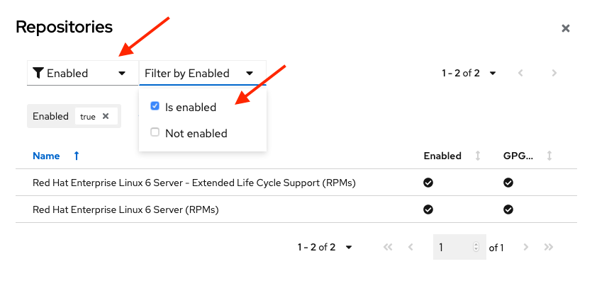

# RHEL - Using Subscription Manager with Simple Content Access Enabled

Updated - 18 May 2021

- Simple Content Access (SCA) allows you to register Red Hat software to access Red Hat software content without attaching a subscription to a particular system or environment.  A great use case for SCA is when you want to manage the content of a public cloud marketplace instance of RHEL with Red Hat Smart Management. SCA enables you to use a Red Hat Smart Management with a public cloud market place instance of RHEL to manage the marketplace content without consuming a RHEL subscription (no double counting subscription usage).  You need a Red Hat Smart Management subscription to support each public cloud marketplace instance of RHEL that will use Red Hat Smart Management.

- With SCA enabled, you no longer can view Red Hat software consumption in the Red Hat Customer Portal subscription section.  You can see which repositories are attached to a particular RHEL instance.  If you want to see the consumption of a particular add-on like the Extended Life Cycle subscription, you can attach that specific subscription to a RHEL instance.

- Note: Even if you are not attaching a subscription to a Red Hat Software product, you are required to have an active subscription for every instance of that product even if the product is in Extended Phase Lifecycle.  For example, if you are running RHEL 4 or 5 along with any other current versions of RHEL, you are required to have active subscriptions to cover all those instances of RHEL.

- It is recommended that you use Subscription Watch to determine the number of RHEL instances that are being used vs. the number of subscriptions you are entitled to use.

- Insights is great tool for seeing and managing RHEL content, and automatically patching and remediating your RHEL instances.  Insights works with RHEL 6.4+, 7.0+ and 8.0+.  I would recommend enabling Insights regardless of your content subscription strategy.  

## Enable SCA on your Red Hat customer portal account
- Login in to the Red Hat Customer Portal  -> [Login](https://access.redhat.com/)


- On the Red Hat Customer Portal page, click the Subscriptions link in the upper left corner.


- On the Overview page, move the slider switch to the right to enable SCA.  The background of the slider switch will turn blue and the text will change from Disabled to Enabled


---
### Create an activation key with no subscriptions attached. 

- For registering RHEL with Red Hat Subscription Management, I recommend using an Activation Key instead of linking the registration to a user.
- Click the Manage drop down link near the upper right of the Red Hat Subscription Management page and chose ActivationKeys.


- Click the New button on the right side of the Activation Keys for Organization ID:xxxxxxxxxx page to create a new Activation Key.


- On the New Activation Key page, fill in the Name text field with the name of your activation key.  Choose a name that makes sense for your organization.  Chose Disabled from the Auto Attach drop down.  Scroll to the bottom of the page and click the Create button.


- Your activation key is ready to use for registering systems with SCA.


---
## Registering System, Adding Repos and Enabling Insights
- Register a system via subscription manager for RHEL 6.0+, 7.0+ and 8.0+.  Note: You will need to use sudo or be root to execute these commands.

      # subscription-manager register --org=xxxxxxxxx --activationkey=your_key_here
      
- Verify that the registered system content access mode is set to SCA.  Note: You will only see the SCA status on RHEL 7.0+ and 8.0+

      # subscription-manager status
      
- Check which repositories are enabled.

      # subscription-manager repos --list-enabled
     
- Repository enablement example for RHEL 6 ELS.

      # subscription-manager repos --enable rhel-6-server-els-rpms    
      
- You can easily find a repository name via the Red Hat Customer Portal.  After logging in to the Red Hat Customer Portal, click on the subscription link near the upper left of the screen.  In the Subscriptions page, click the Subscriptions Tab page and navigate to the subscription with the repository that you want to enable.
- On the product page, click on the Content tab.  I would suggest using the filter field to narrow down the repository list.  Look for the Repository Label for the Repository that you want to enable on your RHEL instance.


 
- You can still attach specific subscriptions (a RHEL 6 ELS subscription for example) if you want to track their subscription usage.  Find the Pool ID of the subscription you want to attach, and then subscribe to that pool.  Use subscription-manager list to see that the correct subscription is attached to your RHEL instance.  You can also validate that the subscription is attached to your RHEL instance on your Red Hat Customer Portal page under Subscriptions.

      # subscription-manager list --available
      # subscription-manager subscribe --pool=xxxxxxxxxxxxxxxxxxxxxxxx
      # subscription-manager list
      
- Since you are not assigning a subscription to the RHEL instance, we cannot know if the RHEL instance should count against Premium, Standard or Self-Support subscription.  You can set the RHEL SLA level from the command line with Subscription Manager.  Setting the SLA level for each RHEL instance well help you to better understand your subscription usage when viewing subscription consumption in Red Hat Insights.  

- Setting the service Level for RHEL 6.0+ and 7.0+ (premium, standard, self-support).

      # subscription-manager service-level --set=premium
      # subscription-manager service-level --show
              
- Setting the service Level for RHEL 8.0+ (Premium, Standard, or Self-Support).

      # subscription-manager service-level --set=Premium
      # subscription-manager service-level --show
      

- Don't forget to install the Insights client to take full advantage of all the capabilities that are part of your RHEL subscription.  No other Linux distribution offers the same capabilities as Insights.
- Insights setup for RHEL 8

      # insights-client --enable
      
- Insights setup for RHEL 6.4+ and 7.0+

      # yum -y install insights-client
      # insights-client --enable
        
---     
## Review your Registered Systems on the Red Hat Customer Portal

- Note: Even with SCA enabled, you can attach subscriptions to systems if for some reason you want to track and control the subscription usage of a specific add-on like an ELS subscription.
- Click on the Systems tab link in the Red Hat Customer Portal (Note: You need to be in the Subscriptions section on the Red Hat Customer Portal.)
- You'll note that there is a question mark (?) by each System Name. This happens when SCA is enabled as you no longer need to attach a subscription to a registered system.  If any subscriptions are attached to a registered system, the number of subscriptions attached wil be registered in the third column.


- To see the details of a registered system, click on the system name and make sure you are on the Details tab page.  On the Details tab page you will notice that the Subscription Management status is unknown and that no subscriptions are attached to the RHEL instance.


- Click on the Subscriptions tab.  You'll notice that there is no subscription information on the Subscriptions Tab page.


- Choose a RHEL system from the Systems page that has a subscription attached to that system.  You will now see the attached subscription and subscription details for that system.


- Back on the Red Hat customer Portal page chose the Subscriptions link.  In the Subscriptions page, scroll through the list and choose a subscription to review.  On the Subscription page make sure you are on the Overview tab page.  Here you can see the subscription quantity available and the number of subscriptions consumed.


- In the same subscription page click the Systems tab to see which RHEL instances have the subscription attached to them.


---
## Reviewing your RHEL systems with groups and custom tags in Red Hat Insights

- Access your Red Hat Insights -> 
- You can create groups and custom tags for your RHEL instance via the Insights client.  You can use these tags in Insights to create more granular views of your systems.  For a complete overview of tagging see the article link in the reference section below.

- You can create a tag from the command line or by creating tags.yaml file in the /etc/insights-client directory
- Create your first group with the insights-client

      # insights-client --group=production-rhel8-premium

- The Insights client will create the group, collect data about your RHEL server and upload to Insights.  The output the above insights-client command will look like the following

      # insights-client --group=production-rhel8-premium
      Starting to collect Insights data for serv01.example.com
      Uploading Insights data.
      Successfully uploaded report from serv01.example.com to account xxxxxxx.
      View details about this system on cloud.redhat.com: https://cloud.redhat.com/insights/inventory/9xxx063-xx02-4x9xe-xxxx-9x30x54x9638
      
- Now when you go to view your RHEL system in Insights under the Inventory tab you can filter by any groups you have created


- You can now add custom tags to your server instance in the tags.yaml file. Custom tags provide you with many ways to create custom filtered views of your systems in the Inventory tab.
- Navigate to /etc/insights and edit the tags.yaml file.  You can create any number of tags that can be used to filter your systems in Insights.
- Here's an example of a tags.yaml file.

```
# tags
---
group: rhel7
serviceLevel: Premium
Lifecycle: Production
Location:
- Moline data center
Repos:
- rhel-7-server-satellite-6.9-rpms
- rhel-7-server-rpms
```
- After updating the /etc/insights-client/tags.yaml file run the insights-client to upload the changes to insights.  Note that running the insights-client command immediately refreshes your insights data.

      # insights-client
      
- In the Inventory when you look at your registered server list, you'll see in the an Tags column the Tag icon is now "highlighted" with a number next to the Tag icon.  THe number next to the Tag icon represents the number of tags associated with a particular RHEL instance.
- Clicking on a Tag icon for a particular server pops up a dialog box with tags available for a specific registered server.


- Let's look at example at using some of the tags I created to filter our Inventory view.
- In the Inventory tab under Inventory section, click the Funnel icon (filter) drop down list and click on the Tags option


- Click the filter drop down list to see all the tags available.  I have created more tags than can fit on one dialog box, so I'm going to change the dialog view to show all of my tags.  Click the x more tags available link.


- In the All tags inventory dialog box, click the 1 of x drop down and choose how many tag per page you would like to see in this dialog box.


- Now in the All tags inventory dialog box, chose the tag you want to use to create a system view and click the Apply tags button at the bottom of the dialog box.


- Now we can see how many systems meet our view options.  Click the Clear filters link to reset you Inventory view.


---
## Reviewing your RHEL Systems in Insights for RHEL 6 Extended Lifecycle Updates.

- We won't be reviewing all of Insights capabilities in this section, but we will review a couple of things in Insights so that you can check that your RHEL ELS 6 content is available to your RHEL system with the ELS repository enabled.  Note: There is a time lag between when you register a system to Insights and when the Insights client has updated your Insights view.

- Login to Insights -> [Login](https://cloud.redhat.com/)
- On the Hybrid Cloud Console, chose the the Red Hat Enterprise Link on the left side of the screen


- On the Insights "home page", you'll be presented with a Dashboard view of your Insights registered RHEL systems.


- Click on the Inventory Link on the left to get a list of RHEL systems registered with Insights.
- I'm going to choose server03 as it is a RHEL 6.10 system with the RHEL 6 ELS repository enabled.  


- You can view the details of server03 on the General Information tab page.  While on the General Information tab page, scroll down to see the number of repositories enabled for server03.  You'll note in this example there are two repositories enabled: one for RHEL 6 RPMs and one for RHEL 6 ELS.


- Click on the Repositories link to see the Repositories enabled for this system. You can set a filter on the dialog box to see just the Enabled repositories.



- If we now click on the Patch tab, we see that because we enabled the RHEL 6 ELS repository with server03, there is ELS related content available (dated after 1 December 2020) for server03


- Now we will compare the content available to a RHEL 6 instance (server05) that does not have the RHEL 6 ELS repository enabled.  We first review the repositories enabled on server05 and see that only one repository, RHEL 6 RPMs, is enabled


 
- Next we go to server05 Patch tab page.  We can see that there is no new content available to this server since 1 December 2020.  With SCA we simply enable the repositories we need associated with a particular RHEL instance to access that content without attaching a subscription.


- Finally you can track your subscription usage in the Subscriptions section of the Red Hat Enterprise Linux view of Red Hat Insights.  Note: This tracks your RHEL usage and subscriptions at a high level i.e. the number RHEL subscriptions of any type against the number of deployed RHEL systems.  It doesn't include add-ons in the subscription usage view.  If you have set the RHEL service-level with subscription-manager (see steps above), you can get a more granular view by filtering on SLA by Premium, Standard, Self-Support, or No SLA.


      

---
### Reference

- How do I enable Simple Content Access for Red Hat Subscription Management? - in the [Simple Content Access article](https://access.redhat.com/articles/simple-content-access)
- [Subscription Manager Command Cheat Sheet](https://access.redhat.com/sites/default/files/attachments/rh_sm_command_cheatsheet_1214_jcs_print.pdf)
- [CHAPTER 5. SYSTEM TAGS AND GROUPS](https://access.redhat.com/documentation/en-us/red_hat_insights/2020-10/html/client_configuration_guide_for_red_hat_insights/insights-client-tagging-overview-con) - Create custom tags for your RHEL systems to use a filter on inventory views
